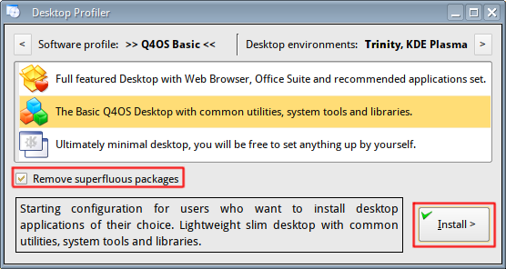
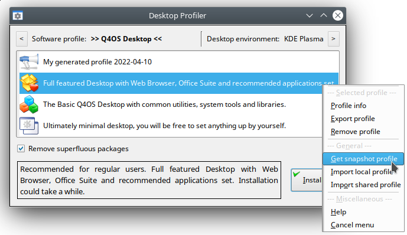
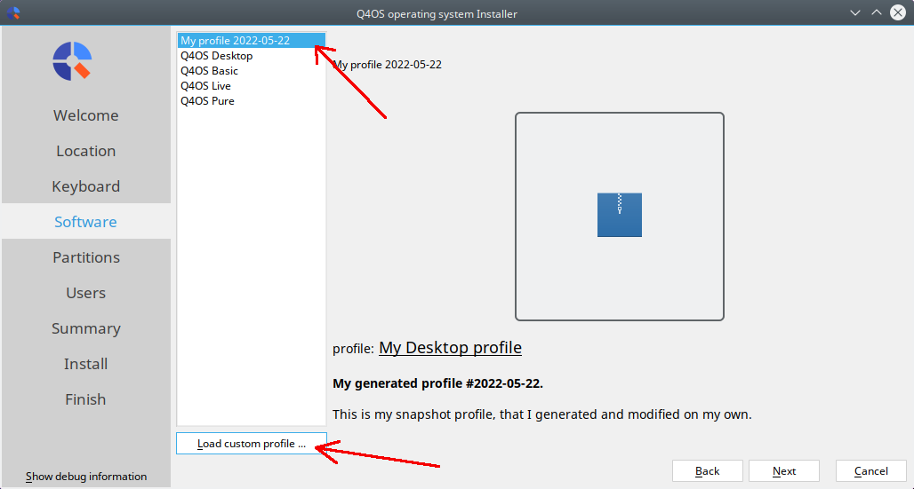

# 🎨 Using Desktop Profiler

### User Manual
*Revision 04/2022*

Source of document: <a href="https://www.q4os.org/dqa016.html" style="color: #2E86AB;">https://www.q4os.org/dqa016.html</a>

---

## 📑 Table of Contents

1. [Introduction](#1-introduction)
2. [Applying a Profile](#2-applying-a-profile)
3. [Custom Profiles](#3-custom-profiles)
4. [Utilize a custom Profile on new Q4OS installation](#4-utilize-a-custom-profile-on-new-q4os-installation)
5. [Additional desktop environments](#5-additional-desktop-environments)

---

## 1. Introduction

Desktop profiler is a powerful tool that allows an easy installation and configuration of pre-defined set of applications and packages at once.

### 🎯 What is a Profile?

In short sense, a **Profile** actually means a list of applications to install. It enables getting a fresh operating system installation configured and ready to work easily and without need of one-by-one applications setup.

### ✨ Key Features

Desktop profiler also provides an easy way to create various custom Profiles:

- 📦 Create your own Profiles
- 🔄 Apply them on each new Q4OS installation
- 💻 Independent of target hardware
- ⚙️ Automate and simplify operating system setup
- 🕐 Recall any Profile anytime later

---

## 2. Applying a Profile

Just run Desktop profiler from Q4OS Software centre, select a desired Profile from the list and click "Install" button.

*Desktop profiler main window*

### ⚙️ Remove superfluous packages option

In order to apply a Profile properly, Desktop profiler would like to uninstall all the packages that don't match the selected Profile.

**You have two options:**

1. **✅ "Remove superfluous packages" checked:**
   - Desktop profiler will remove packages that don't belong to the selected Profile
   - Ensures a clean Profile application

2. **❌ "Remove superfluous packages" unchecked:**
   - Desktop profiler safely installs the selected Profile
   - Doesn't uninstall any packages, even if they don't match the Profile
   - All existing packages remain untouched and installed safely

---

## 3. Custom Profiles

Q4OS supports custom Profiles. Just right click on the Profiles list and select an action from the context menu.

*Desktop profiler context menu*

### 📋 Context Menu Options

**📊 Profile info**
- Get more information about the selected Profile

**📤 Export Profile**
- Export the selected Profile to a single local file
- You can optionally edit and import that local file to the list of Profiles
- See "Import Profile" sections below

**🗑️ Remove Profile**
- Remove the selected Profile from the Profiles list
- ⚠️ Pre-defined system Profiles are fixed and cannot be removed

**📸 Get snapshot Profile**
- Save current system status as a Profile
- A Profile is represented by a single configuration file
- Feel free to modify it according to your needs
- Import it later to the list of Profiles available for installation

**📥 Import local Profile**
- Import a Profile from a local file
- It will be added as a new one in the Profiles list
- Can be applied anytime later
- Just select the Profile file and confirm its insertion

**🌐 Import shared Profile**
- Import a Profile from an Internet source

---

## 4. Utilize a custom Profile on new Q4OS installation

### 🎯 Objective

Perform a new Q4OS installation to get a fresh operating system with applications and packages defined by a custom Profile.

**Scenario:**
- This Profile has been generated earlier on another machine
- You have a flash disk with the Profile file
- Q4OS live media is booted up

### 📝 Installation Steps

1. **Start Calamares installer** to configure the installation options
2. Navigate until you get to the **"Software"** page
3. Click **"Load custom profile"** button
4. Navigate to flash disk and select the custom Profile file
5. The Profile will be imported into the Profiles list
6. Select it and continue clicking the **"Next"** button
7. That's all! The profile will be applied throughout the installation process

*Calamares installer - applying custom desktop profile*

<blockquote style="background-color: #FFF3E0; border-left: 5px solid #F77F00; padding: 15px; margin: 15px 0; border-radius: 5px;">
⚠️ <strong>No Internet Connection:</strong> If you have no Internet connection, the Profile cannot be applied during installation. However, you will be able to apply the Profile on the installed system later using the Desktop profiler tool.
</blockquote>

---

## 5. Additional desktop environments

Desktop profiler offers an option to install an additional Desktop environment aside the default one.

### 🖥️ How to Add

Just click on the **arrow button** top right and select the desired additional desktop environment you want to add.

<blockquote style="background-color: #FFF8E7; border-left: 5px solid #F77F00; padding: 15px; margin: 15px 0; border-radius: 5px;">
👨‍💼 <strong>For Power Users:</strong> This option is intended specifically for administrators and power users who exactly know benefits of multiple desktop environments setup and how to deal with them.
</blockquote>

---

<h3 style="color: white; margin: 0;">Using Desktop Profiler</h3>

<em>User manual, rev. 04/2022</em>

---

📚 <a href="https://www.q4os.org/" style="color: #FFD700; text-decoration: none;">Official Q4OS Website</a> | 
📖 <a href="https://www.q4os.org/documents.html" style="color: #FFD700; text-decoration: none;">Documentation</a> | 
💬 <a href="https://www.q4os.org/forum/" style="color: #FFD700; text-decoration: none;">Community Forum</a>

