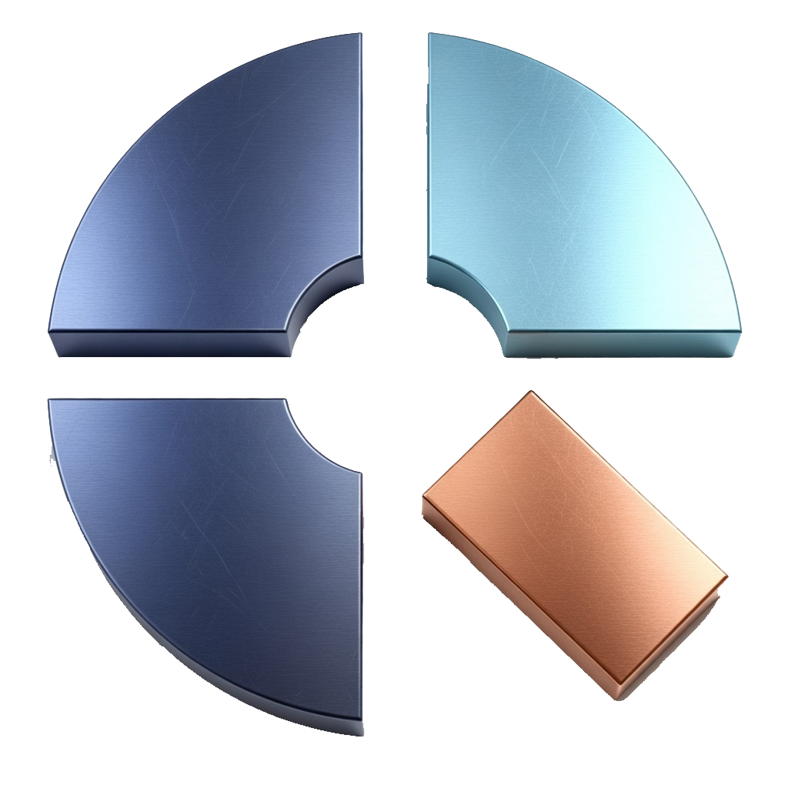
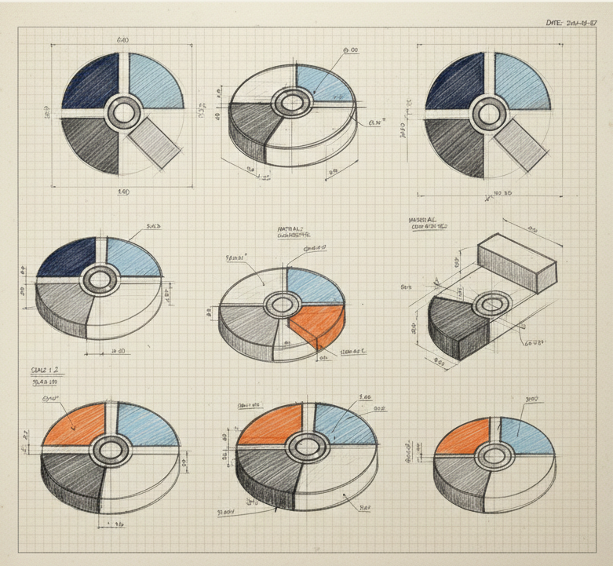
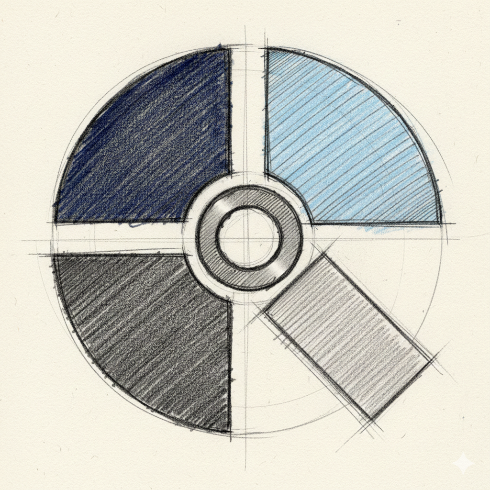
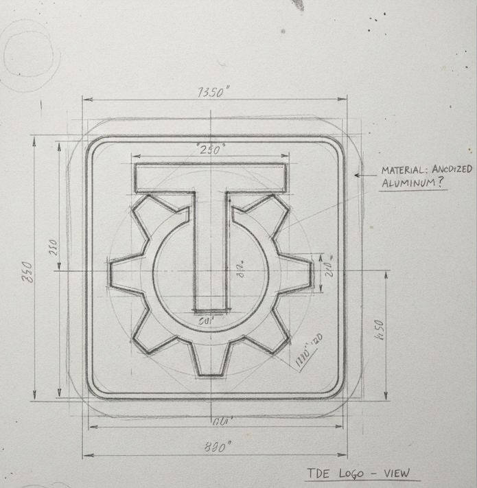

# 🖥️ My Q4OS TDE Collection
### Various apps, tips, and tutorials for the Q4OS Trinity Desktop Environment (TDE).

### 🌐 Read in your language:
[🇬🇧 English](README.md) | [🇫🇷 Français](README.fr.md) | [🇩🇪 Deutsch](README.de.md) | [🇪🇸 Español](README.es.md)

---

## 📂 Table of Contents
* ┌── 🎨 [**UI Customization & Themes**](#-ui-customization--themes)
* ├── 🛠️ [**Desktop Tools & Applets**](#️-desktop-tools--applets)
* ├── 🚀 [**System & Productivity**](#-system--productivity)
* ├── 🖼️ [**Wallpapers & Media**](#️-wallpapers--media)
* ├── 📖 [**DOCS / HOW TO**](#-docs--how-to)
* ├── 📖 [**Reviews & Press**](#-reviews--press)
* └── 🤝 [**Contributions**](#-contributions)

---

## 🎨 UI Customization & Themes
Enhance the visual appeal of Trinity :-)

### [Windows 10 Window Decoration](https://github.com/seb3773/tde-win-deco-Q4WIN10)
A specialized window decoration engine for TDE designed to almost perfectly replicate the Windows 10 border style, providing a familiar and sleek interface for users transitioning to Linux.

### [Q4WIN10 Application Style](https://github.com/seb3773/tdestyle-Q4WIN10)
A native TDE widget style that works in tandem with the window decorations to deliver a consistent Windows 10 look and feel across all Trinity applications.

### [Q4OS XPack](https://github.com/seb3773/q4osXpack)
A comprehensive "Experience Pack" containing various UI enhancements, extra icons, and visual tweaks designed to polish the overall Q4OS user interface. (a bit obsolete, working on a modern version)

### [Q4Riv](https://github.com/TheAsmitKid/Q4Riv)
A minimal, sleek Plymouth theme for Q4OS.

### [Trinity Desktop Color Schemes](./src/color_schemes.md)
A collection of 73 custom color schemes for Trinity Desktop Environment. Includes visual previews and easy installation instructions to customize your desktop appearance.

### [Dekorator Window Decoration Themes](./src/dekorator_resources.md)
A curated collection of 56 Dekorator themes for TDE window decorations. Each theme includes button previews and installation instructions to personalize your window borders.

### [Cursors collection](./src/cursors.md)
Several different mouse cursors compatible with TDE.

### [Icons sets](./src/icons.md)
Several icons themes.

### [xBootSplash](https://github.com/seb3773/xbootsplash)
A minimal boot splash animation for Linux x86_64, designed for initramfs deployment with zero runtime dependencies.

### [Plymouth boot themes collection](./src/boot_plymouth.md)
Plymouth boot themes.

### [KColorSchema](https://github.com/seb3773/kcolorschema)
A fast '.colorscheme' to '.schema' converter for Konsole, enabling seamless color scheme integration in the Trinity terminal.

### [Konsole .schema themes collection](https://github.com/seb3773/konsole-schemas-collection)
A curated collection of .schema themes for Trinity Konsole.

### [TDE panel skins](https://github.com/splatert/tdepanelskins)
Taskbar/Panel skins for the Trinity Desktop Environment.

### [Fonts](./src/fonts.md)
Lots of fonts :-)

### [Trinity Look](https://www.trinity-look.org/)
Eyecandy for your Trinity Desktop.

---

## 🛠️ Desktop Tools & Applets

### [Modern KMenu: classic-x](https://github.com/seb3773/tde-kmenu_classic-x)
An upgrade for the classic TDE menu. It integrates a instant search àla windows10, sidebar refinements, and other improvements.

### [Show Desktop Applet](https://github.com/seb3773/showdeskten-kicker-applet)
A Windows 10-style "Show Desktop" applet for the Kicker panel. It provides a convenient way to minimize all windows and peek at your desktop with a single click.

### [QSidebar](https://github.com/seb3773/qsidebar)
A lightweight and versatile sidebar utility for Q4OS. It offers quick access to system information, frequently used applications, and custom shortcuts. It's Gtk3 based, but offers full integration with Trinity Desktop environment through a dedicated Kicker applet.

### [QSuperL](https://github.com/seb3773/qsuperl)
A handy utility to manage the behavior of the "Super" (Windows) key. It allows you to map the key to open the application menu or trigger custom system actions.

### [Xakar](https://github.com/TheAsmitKid/Xakar)
Native C++ X11 Tiling Daemon.

---

## 🚀 System & Productivity
Optimization scripts and utilities to keep your system running smoothly.

### [Q4OS XPack (System Tweaks)](https://github.com/seb3773/q4osXpack)
Beyond UI changes, the XPack includes a collection of system-level optimizations and extra software configurations to improve performance and usability on Q4OS.

### [Compton TDE optimized](https://github.com/seb3773/compton-tde-x)
An optimized version of the Compton (X11) compositor. Targeting performance and low ressources usage.

### [Konsole Little Theme Manager](https://github.com/seb3773/Konsole-little-theme-manager)
A CLI-based tool designed to easily manage and switch between different color themes for the Trinity terminal (Konsole).

### [Leafbar](https://github.com/blu256/leafbar)
Leafbar is a panel for TDE in the spirit of Deskbar, the desktop panel of BeOS and now Haiku.

### [TDE Easy Projector](https://github.com/blu256/tde-easy-projector)
Extremely simple utility for setting up a projector for a presentation.

### [tdeFlasher](https://github.com/seb3773/tdeflasher)
A lightweight, blazing-fast, OS image flasher natively designed for the Trinity Desktop Environment (TDE) using the TQt3 toolkit.

### [Q4OS i18n](https://github.com/seb3773/q4os-i18n)
A repository dedicated to the internationalization of Q4OS. It contains translation files and localization scripts to make the desktop accessible in multiple languages, don't hesitate ton contribute !!

---

## 🖼️ Wallpapers & Media
## Automated tools to keep your desktop backgrounds fresh and dynamic.

### [Q4OS & Trinity dedicated wallpapers](./src/wallpapers.md)
A beautiful collection of wallpapers specifically designed for Q4OS and Trinity Desktop Environment. Features various artistic styles including 3D renders, glass effects, and Konqi mascot designs.

### [MS Theme Pack Installer](https://github.com/seb3773/msthemepack_installer)
A clever script that allows you to install and extract official Microsoft `.themepack` files on Linux. It automatically sets the included wallpapers and attempts to match the system colors.

### [NASA Wallpapers for TDE](https://github.com/seb3773/nasa-wallpapers-for-linux_tde)
Bring the wonders of space to your desktop. This script fetches the NASA "Astronomy Picture of the Day" and sets it as your TDE wallpaper automatically.

### [Bing Wallpapers for TDE](https://github.com/seb3773/bing-wallpapers-for-linux_tde)
Stay inspired with high-quality daily images. This utility syncs your desktop background with the current Bing homepage image of the day.

### [KMenu Start Button Images](./src/kmenu_start_img.md)
A comprehensive collection of custom start button images for the Trinity KMenu. Over 90 different designs including Q4OS themes, Windows styles, retro computing icons, and creative modern designs to personalize your taskbar.

## Other medias
### [Trinity / TDE pictures, fun images, logos etc...](./src/artwork.md)
A collection images related to Q4OS or TDE.

---

## 📖 DOCS / HOW TO
various documentation, ressources, tips etc...

### [Q4OS FAQ - Trinity Desktop Manual](./src/Q4OS_FAQ.md)
A comprehensive FAQ guide for Q4OS with Trinity Desktop Environment from Q4OS Team. Covers installation, system configuration, desktop customization, and troubleshooting.

### [Q4OS Setup on Debian](./src/Q4OS_Setup_on_Debian.md)
Administrator guide for installing Q4OS on top of any Debian-based distribution (Debian, Devuan, Armbian, Raspberry Pi OS). Includes ARM64 support.

### [Q4OS Setup and Using Guide](./src/Q4OS_Setup_and_Using.md)
Comprehensive user manual covering Q4OS setup, configuration, and daily usage. Includes hardware setup, printing, power management, localization, and system tips.

### [User Galleries - Community Desktop Showcases](./src/user_galleries.md) - 47 community desktop screenshots with submission guidelines

### [Q4OS Desktop Profiler Guide](./src/Q4OS_Desktop_Profiler.md)
User manual for the Desktop Profiler tool. Learn how to apply profiles, create custom profiles, and automate Q4OS installation with pre-configured application sets.

### [Q4OS Custom Application Installer](./src/Q4OS_Custom_Installer.md)
Developer guide for creating custom Q4OS installers (.qsi and .deb packages). Includes examples for Apt, Flatpak, and advanced installer templates.

### [Build an Application for Trinity Desktop](./src/Q4OS_Build_Trinity_App.md)
Developer manual with general recommendations for building applications for Q4OS Trinity. Covers installation rules, directory structure, packaging with Apt, and porting guidelines.

### [TDE Base sources index](https://git.trinitydesktop.org/cgit/tdebase/)
Official Trinity Desktop TDEbase GIT Repositories

### [Trinity Desktop Environment GIT Repositories](https://git.trinitydesktop.org/cgit/)
Official Trinity Desktop Environment GIT Repositories

### [Trinity Desktop - Official Website](https://www.trinitydesktop.org/)
Official Trinity Desktop Environment wiki. Download TDE, access documentation, and join the community.

### [Trinity Desktop - Wikipedia](https://en.wikipedia.org/wiki/Trinity_Desktop_Environment)
Wikipedia article about Trinity Desktop Environment. Comprehensive overview of TDE history, architecture, and development.

### [Trinity Desktop Environment Gentoo wiki](https://wiki.gentoo.org/wiki/Trinity_Desktop_Environment)
Gentoo wiki about Trinity DE

### [Trinity Desktop Environment Arch linux wiki](https://wiki.archlinux.org/title/Trinity)
Arch linux wiki about Trinity DE

### [Trinity Desktop Mailing list](https://mail.trinitydesktop.org/mailman3/hyperkitty/list/users@trinitydesktop.org/latest)
Trinity DE Mailing list

### [The (Un)Official TDE Discord](https://discord.com/invite/93XBe9VuwZ)
Unofficial TDE Discord server. A fun place to discuss our favorite Desktop Environment.

---

## 📖 Reviews & Press
Check out [Reviews, Press & Blogs](src/reviews_press_blogs.md).

## 🖼️ User Galleries
See amazing Q4OS/TDE setups from the community in [User Galleries](src/user_galleries.md).  
Want to share your setup? Check the submission guidelines!

  

---

## 🤝 Contributions
This repo is open to all contributions! Fans of Q4OS Trinity and Trinity Desktop in general, don’t hesitate to submit any useful resources! 😊

  
