# Plymouth Boot Themes

Several different Plymouth boot themes compatible with TDE. Simply download the archive, extract it to `/usr/share/plymouth/themes`, then select your theme and update the initramfs.

|||
|-|-|
| [AmigaKickstartTheme](assets/plymouth/AmigaKickstartTheme.7z) | 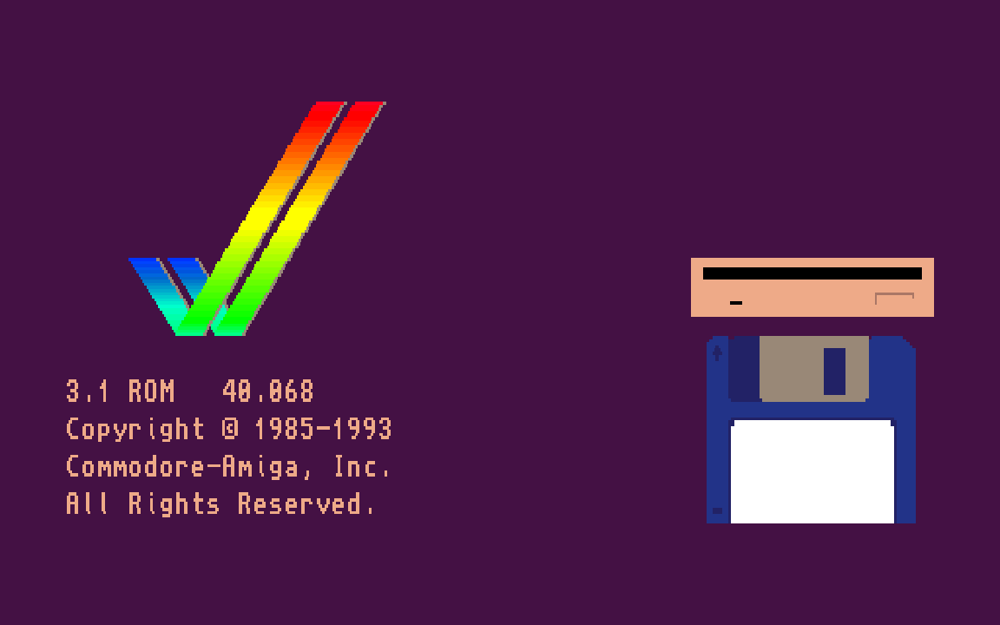 |
| [apple-mac-plymouth](assets/plymouth/apple-mac-plymouth.tar) | 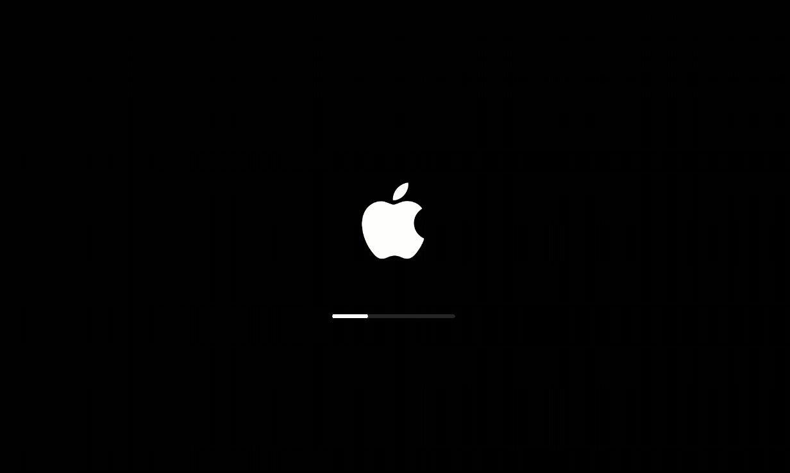 |
| [AtariLogoTheme](assets/plymouth/AtariLogoTheme.7z) | 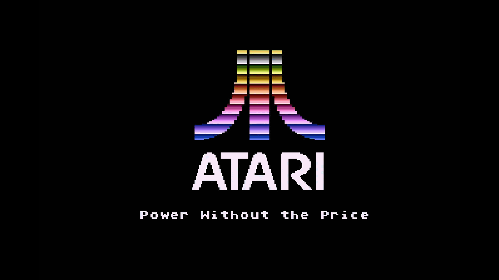 |
| [aurora-borealis](assets/plymouth/aurora-borealis.zip) | 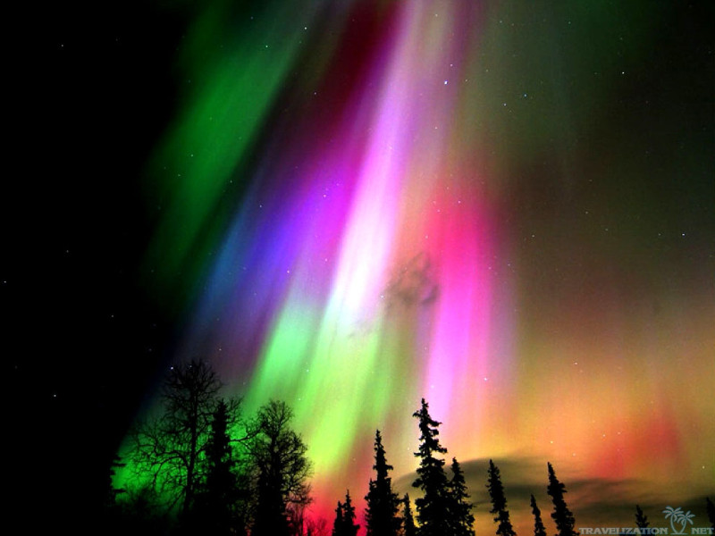 |
| [breeze-neon](assets/plymouth/breeze-neon.tar) | 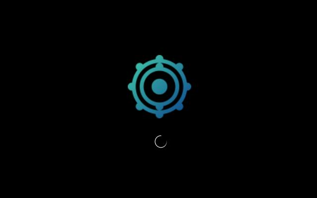 |
| [C64PlymouthTheme](assets/plymouth/C64PlymouthTheme.7z) | 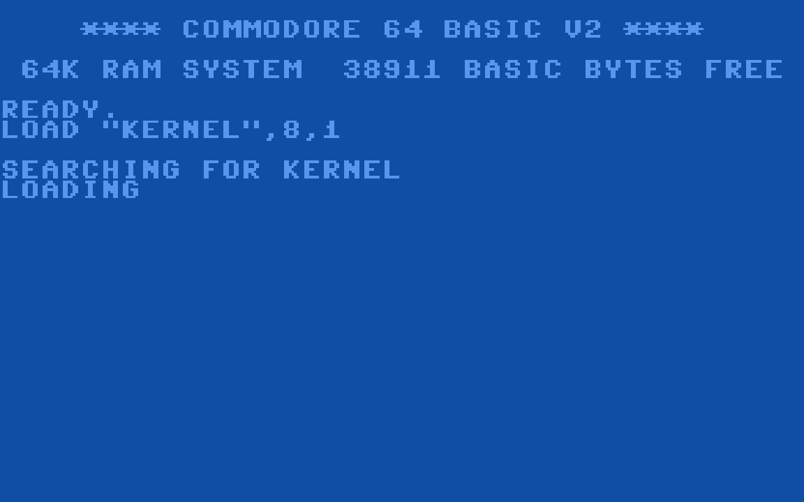 |
| [caledonia-tux](assets/plymouth/caledonia-tux.tar) | 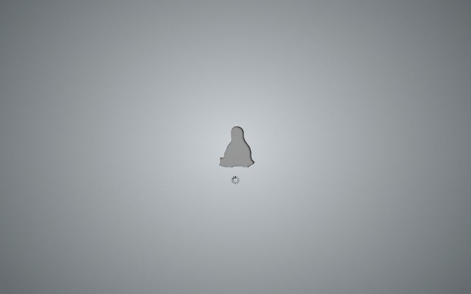 |
| [Cogwheel-a-Spinner-pgr-1-Black](assets/plymouth/Cogwheel-a-Spinner-pgr-1-Black.zip) | 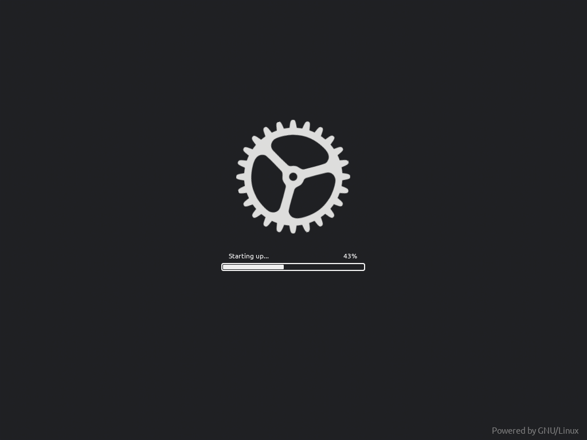 |
| [empire-start](assets/plymouth/empire-start.tar) | 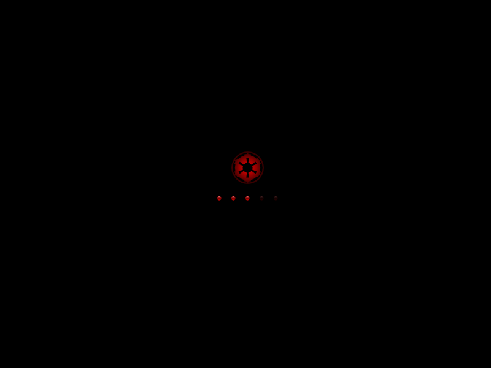 |
| [fallout](assets/plymouth/fallout.tar) | 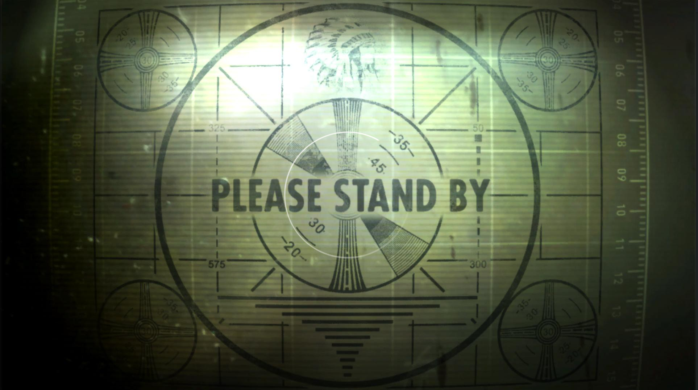 |
| [linuxtext](assets/plymouth/linuxtext.zip) | 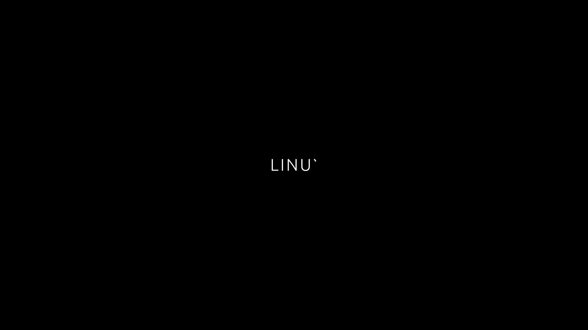 |
| [percentage](assets/plymouth/percentage.tar) | 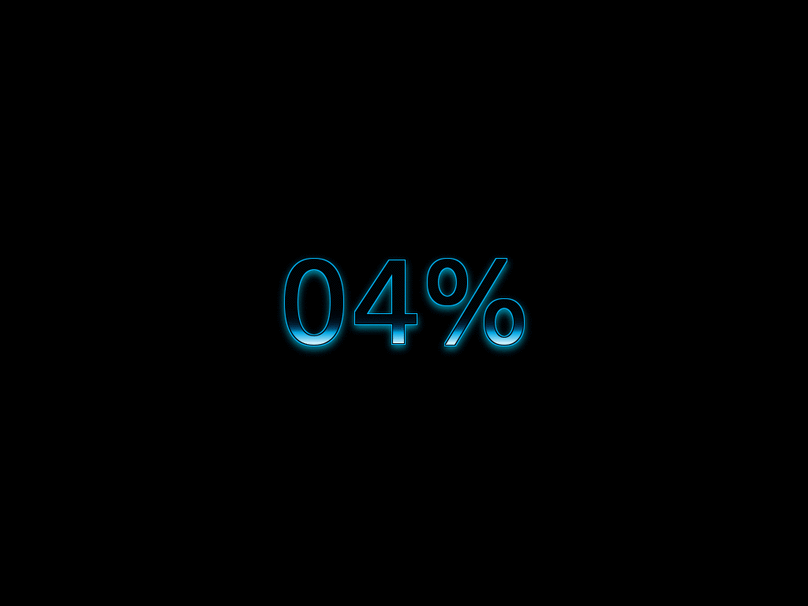 |
| [Plymouth-SteamDeck](assets/plymouth/Plymouth-SteamDeck.zip) |  |
| [plymouth-theme-se98-master](assets/plymouth/plymouth-theme-se98-master.zip) | 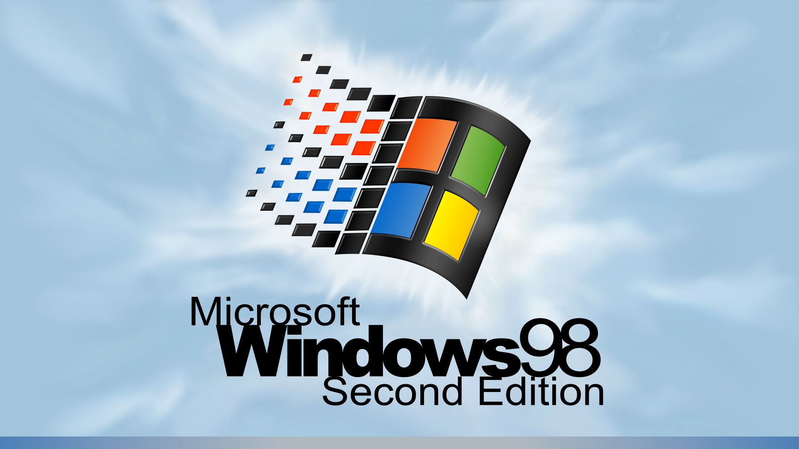 |
| [space-sunrise-0.1](assets/plymouth/space-sunrise-0.1.tar) | 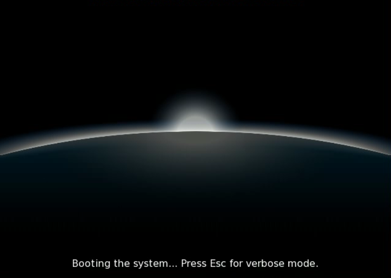 |
| [Unicyclesynced-Ani-10-Light-Gray-Darker](assets/plymouth/Unicyclesynced-Ani-10-Light-Gray-Darker.tar) | 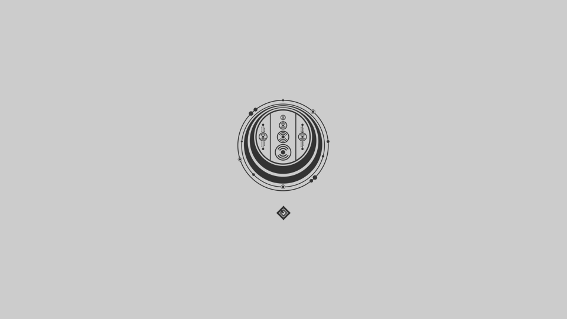 |
| [win10](assets/plymouth/win10.tar.gz) | 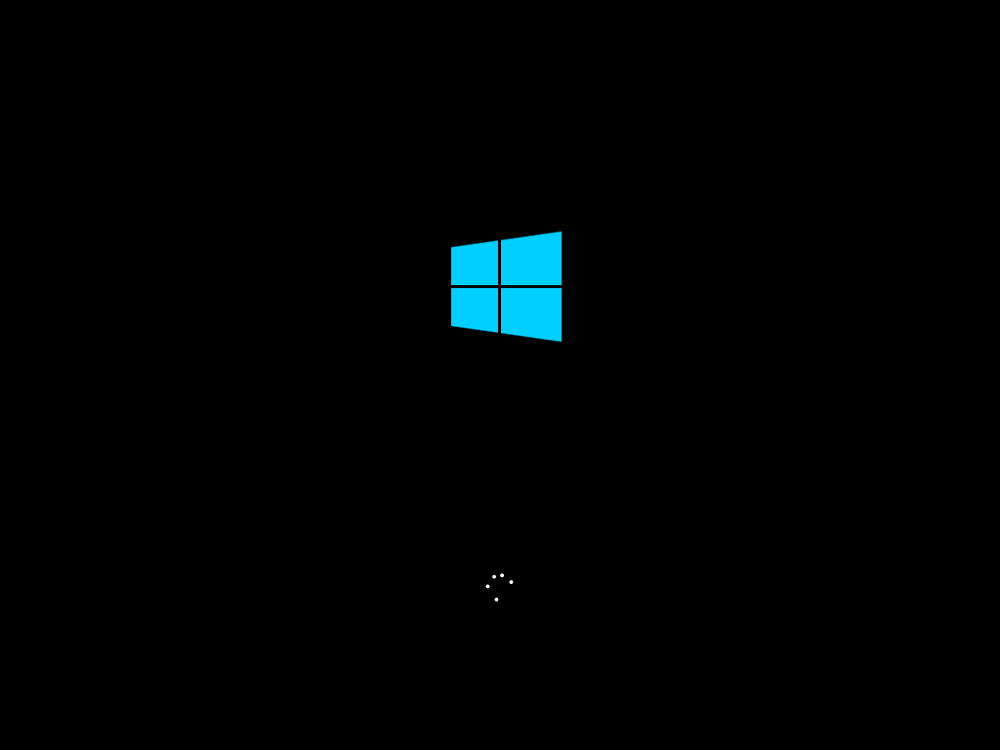 |
| [WindozeXP.Plymouth](assets/plymouth/WindozeXP.Plymouth.tar.gz) | 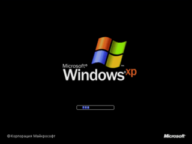 |
| [ZXSpectrum-1080](assets/plymouth/ZXSpectrum-1080.tar.gz) | 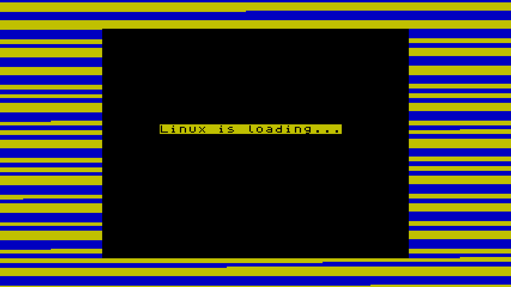 |
