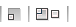
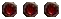

# 🎭 Dekorator Window Decoration Themes

### Custom Window Decoration Collection for TDE

---

## 📋 About

This collection contains custom window decoration themes for the Dekorator engine in Trinity Desktop Environment. Dekorator allows you to customize the appearance of window borders, title bars, and buttons with various artistic styles.

### 📥 Installation

To install a Dekorator theme:
1. Download the desired theme archive (`.tar`, `.tar.gz`, or `.zip`)
2. Extract the archive
3. Copy the theme folder to `~/.trinity/share/config/twindeKoratorrc/`
4. Apply via: `Control Panel → Appearance & Themes → Window Decorations → Dekorator`

---

## 🎭 Available Themes

| Theme Name | Preview | Download |
|------------|---------|----------|
| **137696 Vectorcell2b** |  | [Download](./assets/dekorator/137696-Vectorcell2b-theme.tar) |
| **AmigaOS 4.1** |  | [Download](./assets/dekorator/AmigaOS4_1-1-theme.tar) |
| **Area 51** |  | [Download](./assets/dekorator/Area-51.tar) |
| **Bluebird** |  | [Download](./assets/dekorator/bluebird-theme.tar) |
| **Bushido Yellow** |  | [Download](./assets/dekorator/Bushido-Yellow.tar) |
| **Candido Selected** |  | [Download](./assets/dekorator/Candido-Selected-theme.tar) |
| **Candido** |  | [Download](./assets/dekorator/Candido-theme.tar) |
| **Clay** |  | [Download](./assets/dekorator/Clay.tar) |
| **Crapsta II** |  | [Download](./assets/dekorator/crapsta-II.tar) |
| **Crystal Recurve** |  | [Download](./assets/dekorator/Crystal-recurve-theme.tar) |
| **Dagi 0.3** |  | [Download](./assets/dekorator/Dagi%200.3-theme.tar) |
| **de-Leopard 0.0.3** |  | [Download](./assets/dekorator/de-Leopard-0.0.3-theme.tar) |
| **Dworkin Dark Dek** |  | [Download](./assets/dekorator/dworkindarkdek.tar) |
| **Dworkin Dek** |  | [Download](./assets/dekorator/dworkindek.tar) |
| **Elemental OSX** |  | [Download](./assets/dekorator/ElementalOSX.tar) |
| **Elementos Graphite** |  | [Download](./assets/dekorator/elementos_graphite.tar) |
| **Fallout** |  | [Download](./assets/dekorator/Fallout.tar) |
| **FlatCat Dekorator** |  | [Download](./assets/dekorator/FlatCat_dekorator.tar) |
| **Glassified deKorator** |  | [Download](./assets/dekorator/Glassified_deKorator-theme.tar) |
| **Graphitech** |  | [Download](./assets/dekorator/Graphitech.tar) |
| **Gray Window Decorator by Bober** |  | [Download](./assets/dekorator/Gray_Window_decorator_by_bober.tar) |
| **Illuminate** |  | [Download](./assets/dekorator/Illuminate.tar) |
| **Kollide PSX** |  | [Download](./assets/dekorator/kollide-psx.tar) |
| **Kore** |  | [Download](./assets/dekorator/kore-theme.tar) |
| **Ktechno** |  | [Download](./assets/dekorator/Ktechno.tar) |
| **Linspire Clear** |  | [Download](./assets/dekorator/Linspire%20Clear.tar) |
| **Mint Kore** |  | [Download](./assets/dekorator/mint-kore-theme.tar) |
| **Mod Silverchill** |  | [Download](./assets/dekorator/Mod-Silverchill.tar) |
| **Modern Dekorator v1** |  | [Download](./assets/dekorator/modern-dekorator-v1.tar) |
| **MorphOS 2** |  | [Download](./assets/dekorator/MorphOS2-theme.tar) |
| **Murrine** |  | [Download](./assets/dekorator/Murrine-theme.tar) |
| **Murrine Rounded** |  | [Download](./assets/dekorator/MurrineRounded-theme.tar.gz) |
| **Murrine Rounded No Corners** |  | [Download](./assets/dekorator/MurrineRounded_NoCorners-theme.tar.gz) |
| **MyAqua** |  | [Download](./assets/dekorator/MyAqua-theme.tar) |
| **NOOTO** |  | [Download](./assets/dekorator/NOOTO-theme.tar.gz) |
| **Onyx Lava** |  | [Download](./assets/dekorator/onyxlava-theme.tar) |
| **Owl RMX Remixed** |  | [Download](./assets/dekorator/owl_rmx_remixed.tar) |
| **Phacile Blue 0.2** |  | [Download](./assets/dekorator/Phacile-blue-theme-0.2.tar.gz) |
| **Phacile Color Schemes** | - | [Download](./assets/dekorator/Phacile-color-schemes.tar.gz) |
| **Phacile Green 0.2** |  | [Download](./assets/dekorator/Phacile-green-theme-0.2.tar.gz) |
| **Runas** |  | [Download](./assets/dekorator/runas.tar) |
| **S White 0.1** |  | [Download](./assets/dekorator/S_White-0.1-theme.tar) |
| **Seven** |  | [Download](./assets/dekorator/seven-theme.tar) |
| **Silverchill** |  | [Download](./assets/dekorator/silverchill-theme.tar) |
| **Siro 0.2** |  | [Download](./assets/dekorator/Siro0.2.tar) |
| **Sleek and Simple** |  | [Download](./assets/dekorator/Sleek_and_Simple.tar) |
| **Slimline** |  | [Download](./assets/dekorator/slimline-theme.tar) |
| **Smooth Milk Tango 0.9.5** |  | [Download](./assets/dekorator/smoothmilktango%200.9.5-theme.tar) |
| **Suse Aero** |  | [Download](./assets/dekorator/Suse-Aero-Theme.tar) |
| **The K-style Infinity** |  | [Download](./assets/dekorator/The%20K-style_%20Infinity-theme.tar) |
| **Titan 5** |  | [Download](./assets/dekorator/Titan5-theme.tar) |
| **Unity Orange SE** |  | [Download](./assets/dekorator/unity-orange-SE-theme.tar) |
| **Windows 3.1 Arizona** |  | [Download](./assets/dekorator/Windows-3.1-Arizona-theme.tar.gz) |
| **Wineight** |  | [Download](./assets/dekorator/Wineight-theme.tar) |
| **XP** |  | [Download](./assets/dekorator/xp-theme.tar) |
| **Xperimental** |  | [Download](./assets/dekorator/Xperimental-theme.tar) |

---

<h3 style="color: white; margin: 0;">Dekorator Window Decoration Themes</h3>

<em>Transform your window decorations</em>

---

🎭 Total Themes: <strong>56</strong> | 
📦 Formats: <strong>.tar, .tar.gz</strong>

