# 🚀 KMenu Start Button Images Collection

A comprehensive collection of custom start button images for the Trinity Desktop Environment KMenu. Personalize your taskbar with various styles ranging from classic OS designs to modern and creative themes.

## Start Button Gallery

| Name | Preview |
|------|---------|
| atari | <a href="./assets/start_button_images/atari.png"></a> |
| circle | <a href="./assets/start_button_images/circle.png"></a> |
| start_alien_black | <a href="./assets/start_button_images/start_alien_black.png"></a> |
| start_alien_grey | <a href="./assets/start_button_images/start_alien_grey.png"></a> |
| start_amiga | <a href="./assets/start_button_images/start_amiga.png"></a> |
| start_android | <a href="./assets/start_button_images/start_android.png"></a> |
| start_apple_black | <a href="./assets/start_button_images/start_apple_black.png"></a> |
| start_apple_chrome | <a href="./assets/start_button_images/start_apple_chrome.png"></a> |
| start_apple | <a href="./assets/start_button_images/start_apple.png"></a> |
| start_arrow_dark | <a href="./assets/start_button_images/start_arrow_dark.png"></a> |
| start_arrow | <a href="./assets/start_button_images/start_arrow.png"></a> |
| start_burger_black | <a href="./assets/start_button_images/start_burger_black.png"></a> |
| start_burger | <a href="./assets/start_button_images/start_burger.png"></a> |
| start_chevrons_white | <a href="./assets/start_button_images/start_chevrons_white.png"></a> |
| start_chevrons | <a href="./assets/start_button_images/start_chevrons.png"></a> |
| start_circle_burger | <a href="./assets/start_button_images/start_circle_burger.png"></a> |
| start_circle_white | <a href="./assets/start_button_images/start_circle_white.png"></a> |
| start_debian_dark | <a href="./assets/start_button_images/start_debian_dark.png"></a> |
| start_debian | <a href="./assets/start_button_images/start_debian.png"></a> |
| start_debian2 | <a href="./assets/start_button_images/start_debian2.png"></a> |
| start_fallout | <a href="./assets/start_button_images/start_fallout.png">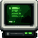</a> |
| start_green | <a href="./assets/start_button_images/start_green.png"></a> |
| start_home | <a href="./assets/start_button_images/start_home.png"></a> |
| start_kde_circle_dark | <a href="./assets/start_button_images/start_kde_circle_dark.png"></a> |
| start_kde_circle | <a href="./assets/start_button_images/start_kde_circle.png"></a> |
| start_kde_opac | <a href="./assets/start_button_images/start_kde_opac.png"></a> |
| start_kde | <a href="./assets/start_button_images/start_kde.png"></a> |
| start_kde2_copper | <a href="./assets/start_button_images/start_kde2_copper.png"></a> |
| start_kde2 | <a href="./assets/start_button_images/start_kde2.png"></a> |
| start_launchpad | <a href="./assets/start_button_images/start_launchpad.png"></a> |
| start_layers_black | <a href="./assets/start_button_images/start_layers_black.png"></a> |
| start_layers_blue | <a href="./assets/start_button_images/start_layers_blue.png"></a> |
| start_leaf | <a href="./assets/start_button_images/start_leaf.png"></a> |
| start_mac_nb | <a href="./assets/start_button_images/start_mac_nb.png">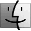</a> |
| start_mac | <a href="./assets/start_button_images/start_mac.png"></a> |
| start_mushroom | <a href="./assets/start_button_images/start_mushroom.png"></a> |
| start_mx_gold | <a href="./assets/start_button_images/start_mx_gold.png"></a> |
| start_mx | <a href="./assets/start_button_images/start_mx.png"></a> |
| start_off | <a href="./assets/start_button_images/start_off.png">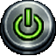</a> |
| start_playsta | <a href="./assets/start_button_images/start_playsta.png"></a> |
| start_plex | <a href="./assets/start_button_images/start_plex.png"></a> |
| start_plex2 | <a href="./assets/start_button_images/start_plex2.png"></a> |
| start_prompt_white | <a href="./assets/start_button_images/start_prompt_white.png"></a> |
| start_prompt | <a href="./assets/start_button_images/start_prompt.png"></a> |
| start_q4os_1 | <a href="./assets/start_button_images/start_q4os_1.png"></a> |
| start_q4os_antic | <a href="./assets/start_button_images/start_q4os_antic.png"></a> |
| start_q4os_drawing | <a href="./assets/start_button_images/start_q4os_drawing.png"></a> |
| start_q4os_large | <a href="./assets/start_button_images/start_q4os_large.png"></a> |
| start_q4os_marble | <a href="./assets/start_button_images/start_q4os_marble.png"></a> |
| start_q4os_metal | <a href="./assets/start_button_images/start_q4os_metal.png"></a> |
| start_q4os_steampunk | <a href="./assets/start_button_images/start_q4os_steampunk.png">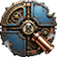</a> |
| start_q4os_synthwave | <a href="./assets/start_button_images/start_q4os_synthwave.png">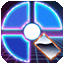</a> |
| start_q4os_tde | <a href="./assets/start_button_images/start_q4os_tde.png"></a> |
| start_q4os_wood | <a href="./assets/start_button_images/start_q4os_wood.png">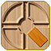</a> |
| start_q4os_wood2 | <a href="./assets/start_button_images/start_q4os_wood2.png">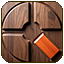</a> |
| start_scifi | <a href="./assets/start_button_images/start_scifi.png"></a> |
| start_skull | <a href="./assets/start_button_images/start_skull.png"></a> |
| start_start | <a href="./assets/start_button_images/start_start.png"></a> |
| start_steam | <a href="./assets/start_button_images/start_steam.png"></a> |
| start_tde_antic | <a href="./assets/start_button_images/start_tde_antic.png">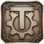</a> |
| start_tde_flat | <a href="./assets/start_button_images/start_tde_flat.png"></a> |
| start_tde_gold | <a href="./assets/start_button_images/start_tde_gold.png"></a> |
| start_tde_ink | <a href="./assets/start_button_images/start_tde_ink.png"></a> |
| start_tde_metal | <a href="./assets/start_button_images/start_tde_metal.png"></a> |
| start_tde_neon | <a href="./assets/start_button_images/start_tde_neon.png"></a> |
| start_tde_wood | <a href="./assets/start_button_images/start_tde_wood.png"></a> |
| start_touch | <a href="./assets/start_button_images/start_touch.png"></a> |
| start_triangle_red | <a href="./assets/start_button_images/start_triangle_red.png"></a> |
| start_triangle | <a href="./assets/start_button_images/start_triangle.png"></a> |
| start_wblue | <a href="./assets/start_button_images/start_wblue.png"></a> |
| start_win_circle | <a href="./assets/start_button_images/start_win_circle.png"></a> |
| start_win_colors | <a href="./assets/start_button_images/start_win_colors.png"></a> |
| start_win_glass | <a href="./assets/start_button_images/start_win_glass.png"></a> |
| start_win_large | <a href="./assets/start_button_images/start_win_large.png"></a> |
| start_win_sphere | <a href="./assets/start_button_images/start_win_sphere.png"></a> |
| start_win | <a href="./assets/start_button_images/start_win.png"></a> |
| start_win1 | <a href="./assets/start_button_images/start_win1.png"></a> |
| start_win11_2 | <a href="./assets/start_button_images/start_win11_2.png">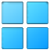</a> |
| start_win11_white | <a href="./assets/start_button_images/start_win11_white.png"></a> |
| start_win11 | <a href="./assets/start_button_images/start_win11.png"></a> |
| start_win31 | <a href="./assets/start_button_images/start_win31.png">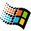</a> |
| start_xbox_orb_black | <a href="./assets/start_button_images/start_xbox_orb_black.png"></a> |
| start_xbox_orb | <a href="./assets/start_button_images/start_xbox_orb.png"></a> |
| start_xbox | <a href="./assets/start_button_images/start_xbox.png"></a> |
| StartHere_color | <a href="./assets/start_button_images/StartHere_color.png"></a> |
| StartHere | <a href="./assets/start_button_images/StartHere.png">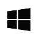</a> |
| StartHere2_color | <a href="./assets/start_button_images/StartHere2_color.png"></a> |
| StartHere2 | <a href="./assets/start_button_images/StartHere2.png"></a> |
| StartHere3 | <a href="./assets/start_button_images/StartHere3.png"></a> |
| StartHere4 | <a href="./assets/start_button_images/StartHere4.png"></a> |
| StartXP | <a href="./assets/start_button_images/StartXP.png"></a> |

## Installation

To use these start button images in Trinity Desktop:
1. Click on any thumbnail above to view the full-size image
2. Right-click and save the image to your computer
3. Right-click on the KMenu button (start button) in your taskbar
4. Select "Configure Panel" → "Appearance" → "Buttons"
5. Click on the KMenu button icon and browse to select your downloaded image

## Download All

You can download the entire collection by cloning this repository:
```bash
git clone https://github.com/seb3773/q4os_tde_collection.git
cd q4os_tde_collection/assets/start_button_images
```

---

[← Back to Main README](./README.md)
