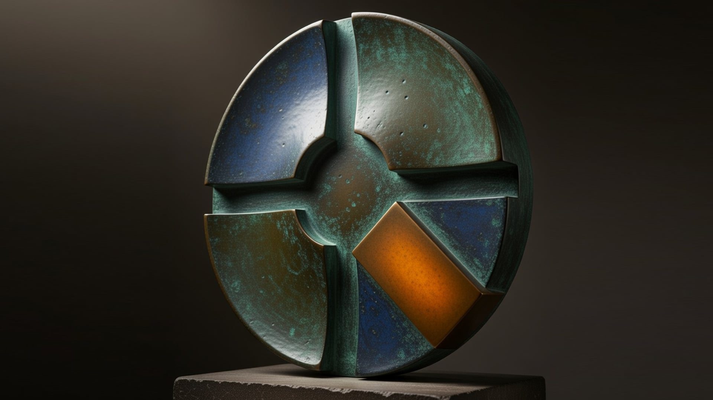
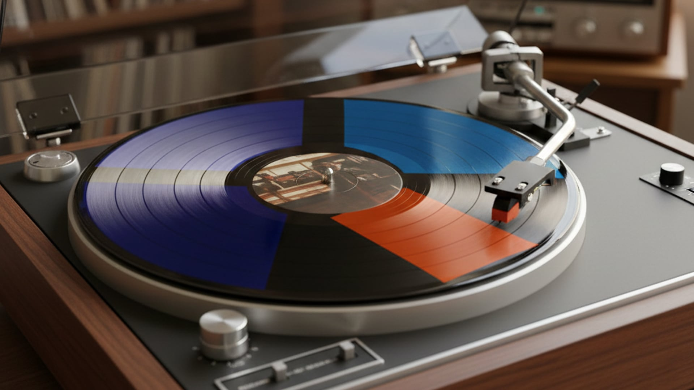
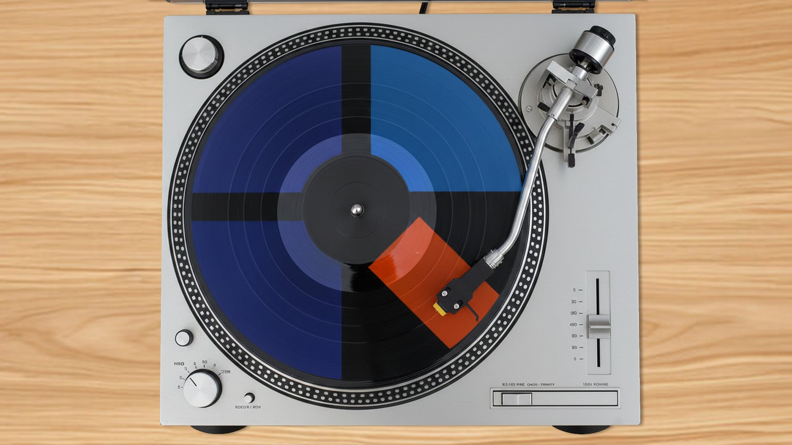
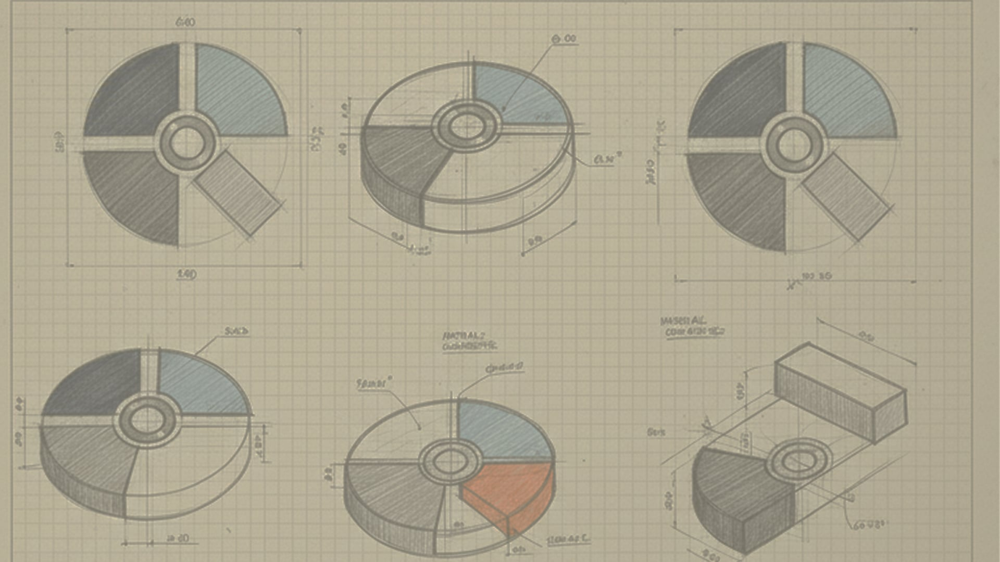
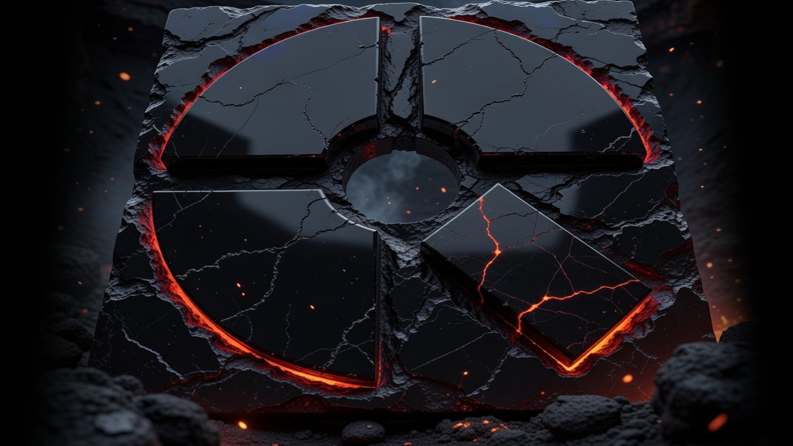
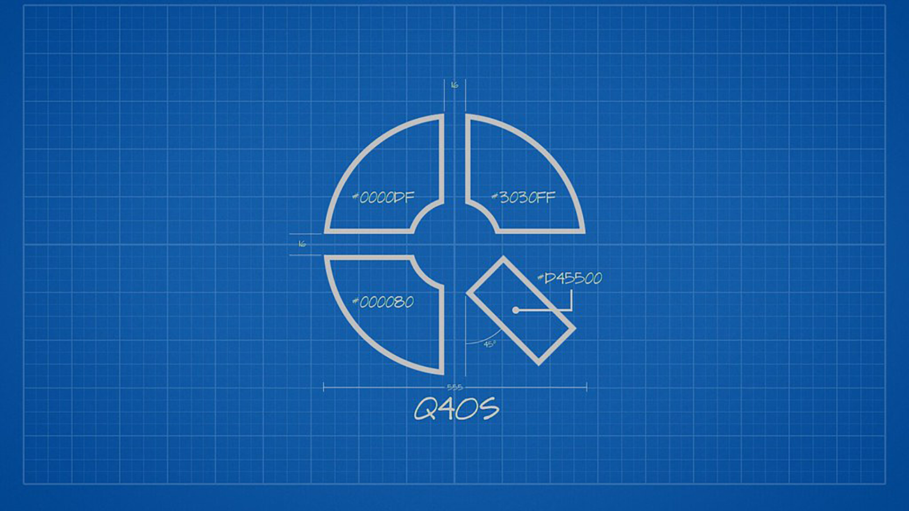
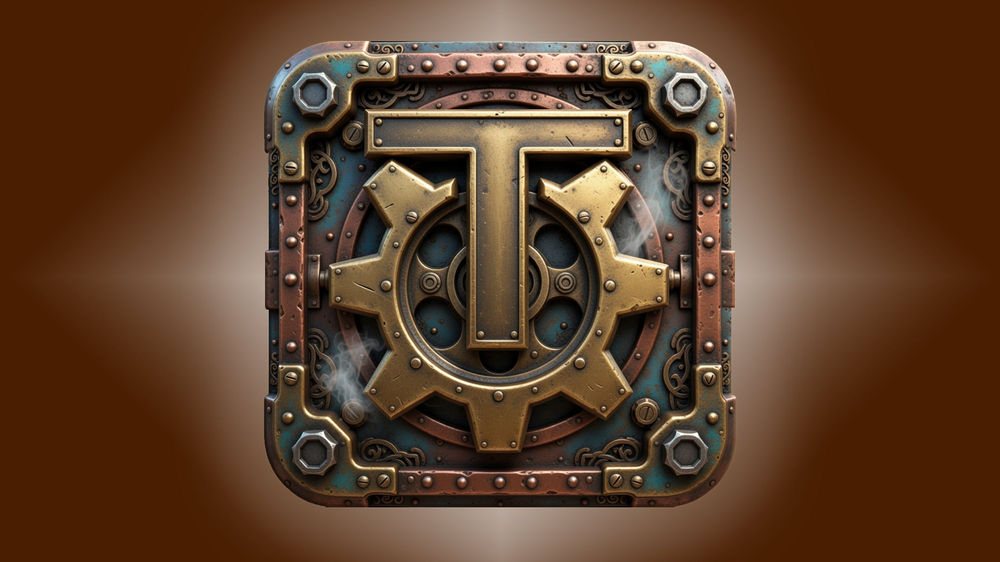
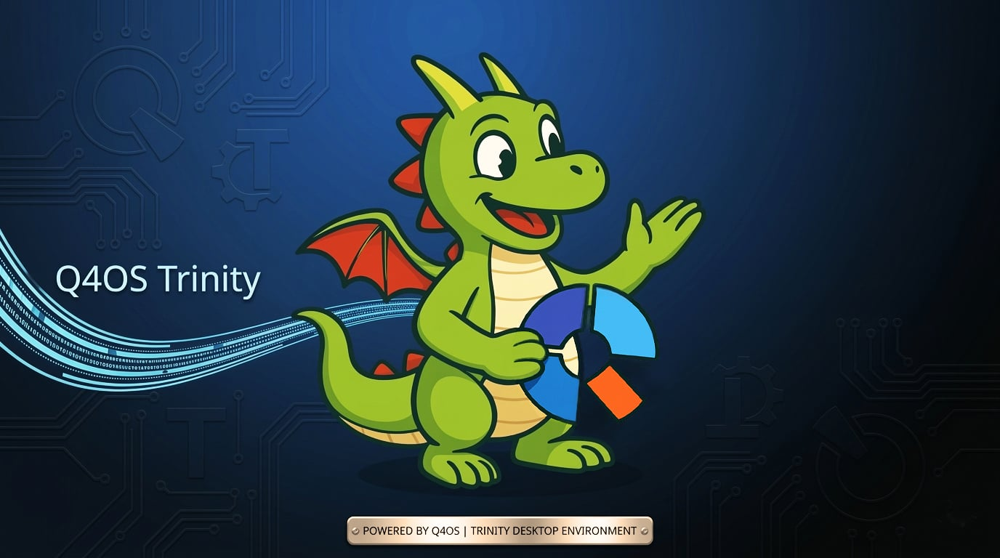

# 🖼️ Q4OS & Trinity Wallpapers Collection

A curated collection of dedicated wallpapers for Q4OS and Trinity Desktop Environment.

## Wallpapers Gallery

| Name | Preview |
|------|---------|
| konqi_tde_q4os | <a href="./assets/wallpapers/konqi_tde_q4os.jpg"></a> |
| wallpaper_q4os_antic | <a href="./assets/wallpapers/wallpaper_q4os_antic.jpg"></a> |
| wallpaper_q4os_disc2 | <a href="./assets/wallpapers/wallpaper_q4os_disc2.jpg"></a> |
| wallpaper_q4os_disc3 | <a href="./assets/wallpapers/wallpaper_q4os_disc3.jpg"></a> |
| wallpaper_q4os_glass | <a href="./assets/wallpapers/wallpaper_q4os_glass.jpg"></a> |
| wallpaper_q4os_gold | <a href="./assets/wallpapers/wallpaper_q4os_gold.jpg"></a> |
| wallpaper_q4os_hellfire | <a href="./assets/wallpapers/wallpaper_q4os_hellfire.jpg"></a> |
| wallpaper_q4os_konqi | <a href="./assets/wallpapers/wallpaper_q4os_konqi.jpg"></a> |
| wallpaper_q4os_konqi2 | <a href="./assets/wallpapers/wallpaper_q4os_konqi2.jpg"></a> |
| wallpaper_q4os_konqi3 | <a href="./assets/wallpapers/wallpaper_q4os_konqi3.jpg"></a> |
| wallpaper_q4os_schemas | <a href="./assets/wallpapers/wallpaper_q4os_schemas.jpg"></a> |
| wallpaper_q4os_volcanic | <a href="./assets/wallpapers/wallpaper_q4os_volcanic.jpg"></a> |
| wallpaper_tde_3d | <a href="./assets/wallpapers/wallpaper_tde_3d.jpg"></a> |
| q4os-flat_jaerrib | <a href="./assets/wallpapers/q4os-flat_jaerrib.jpg"></a> |
| q4os-flat-dark | <a href="./assets/wallpapers/q4os-flat-dark.jpg"></a> |
| wallpaper_bandit_silachai_1 | <a href="./assets/wallpapers/wallpaper_bandit_silachai_1.jpg"></a> |
| wallpaper_bandit_silachai_2 | <a href="./assets/wallpapers/wallpaper_bandit_silachai_2.jpg"></a> |
| wallpaper_bandit_silachai_3 | <a href="./assets/wallpapers/wallpaper_bandit_silachai_3.jpg"></a> |
| wallpaper_bandit_silachai_4 | <a href="./assets/wallpapers/wallpaper_bandit_silachai_4.jpg"></a> |
| wallpaper_tde_steampunk | <a href="./assets/wallpapers/wallpaper_tde_steampunk.jpg"></a> |
| wallpaper_q4ostde-konqi | <a href="./assets/wallpapers/wallpaper_q4ostde-konqi.jpg"></a> |

## Installation

To use these wallpapers:
1. Click on any thumbnail above to view the full-size image
2. Right-click and save the image to your computer
3. In Trinity Desktop, right-click on the desktop → Configure Desktop → Background
4. Select the downloaded wallpaper

## Download All

You can download the entire collection by cloning this repository:
```bash
git clone https://github.com/seb3773/q4os_tde_collection.git
cd q4os_tde_collection/assets/wallpapers
```

---

[← Back to Main README](../README.md)
